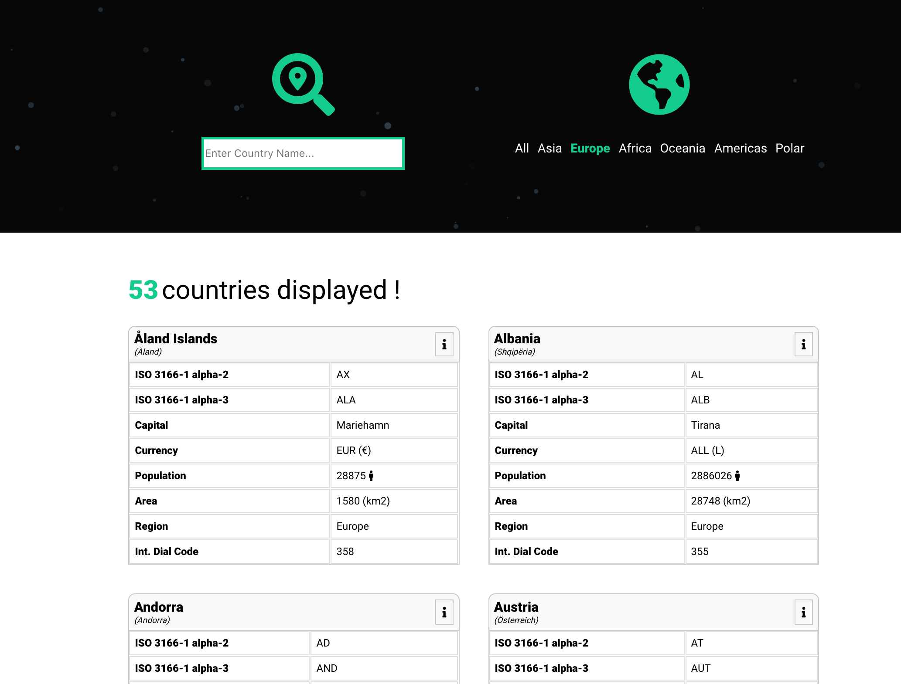
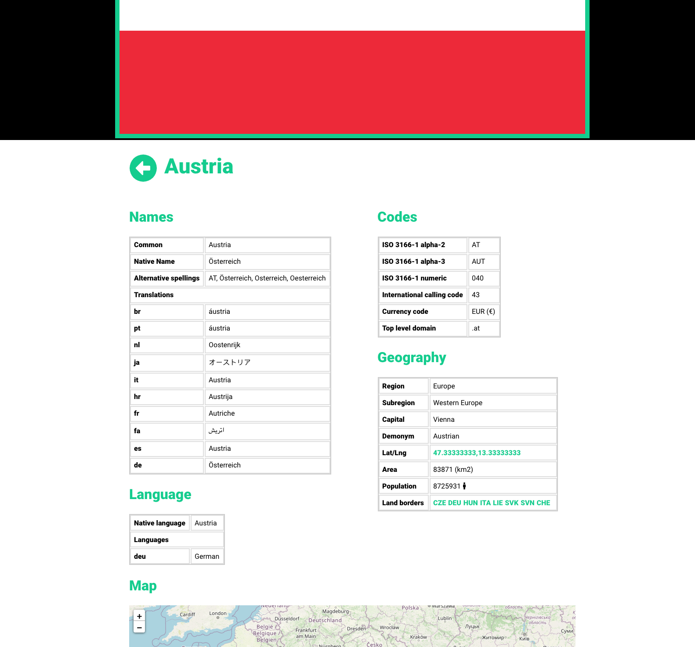

<!-- AUTO-GENERATED-CONTENT:START (STARTER) -->
<p align="center">
  <a href="https://www.gatsbyjs.org">
    
  </a>
</p>
<h1 align="center">
  World countries Info
</h1>

Kick off your project with this default boilerplate. This starter ships with the main Gatsby configuration files you might need to get up and running blazing fast with the blazing fast app generator for React.

_Have another more specific idea? You may want to check out our vibrant collection of [official and community-created starters](https://www.gatsbyjs.org/docs/gatsby-starters/)._

## 🚀 Quick start

1.  **Start developing.**

    Navigate into your new site’s directory and start it up.

    ```shell
    cd gatsby-countries/
    gatsby develop
    ```

1.  **Open the source code and start editing!**

    Your site is now running at `http://localhost:8000`!

<p align="center">
  <a href="https://www.gatsbyjs.org">
    
  </a>
</p>
